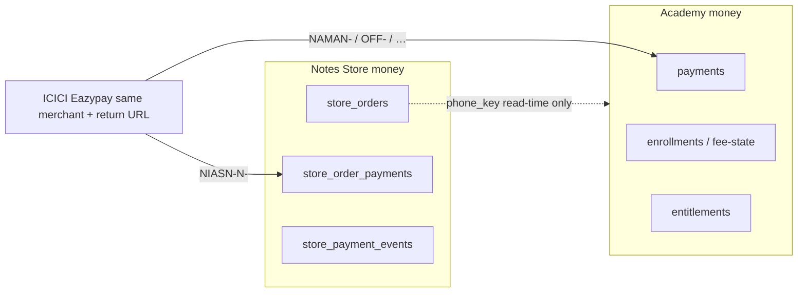
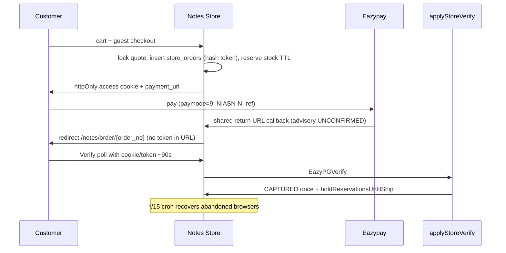

# Notes Store — architecture

## Placement

The Notes Store is **not** a separate app. It lives in the same Next.js 14 App Router deploy, same domain, same Vercel project as the Academy public site, portal, and admin.

| Surface | Location |
|---------|----------|
| Public storefront | `app/(site)/notes/**` |
| Customer APIs | `app/api/notes/**` |
| Admin UI | `app/admin/notes/**` |
| Admin APIs | `app/api/admin/notes/**` |
| Domain logic | `lib/store/**` |
| UI | `components/notes/**` |
| Verify recovery cron | `app/api/cron/notes-store-verify` |

## Money domain isolation

- Store **never** writes `payments`, `students`, `buyers`, `leads`, enrollments, fee-state, or entitlements.
- Sole soft link: `phone_key` (10 digits) for optional read-time matching — never stored as an Academy FK.
- CI guard: `scripts/ci/guard-store-domain-isolation.mjs` (forbidden imports/symbols/tables).
- Academy `payments.item_type` constrained away from store (migration `2026-09-16-notes-store-1a-item-type-constraint.sql`).

## Server / client / cache

| Kind | Pattern |
|------|---------|
| Catalogue pages | Server Components + `unstable_cache` / ISR tags (`STORE_CACHE_TAG`) |
| Cart / checkout / order / track | `force-dynamic` + `Cache-Control: no-store` |
| PublicNav Notes link | Client fetch `/api/notes/status` — **must not** read session in `(site)/layout` |
| Cart badge | Client hydrate from cart API |

## Purchase flow

## Guest identity

Checkout upserts `store_customers` by `phone_key` only. No login code, no portal session, no Academy student/buyer row.

## Attribution

At checkout, `requestLeadAttribution()` reads first-party `nsa_attr` cookie and freezes into `store_orders.attribution_*` (store tables only).

## Kill switch

`app_feature_flags.key = notes_store`. `kill_switch` wins everywhere. Preview may open via `NOTES_STORE_PREVIEW_ENABLE` when not production. Layout 404s / APIs return not-found when dark.

## Fulfilment (Phase 1)

Paid → admin queue → manual status advance → manual courier/AWB (`store_shipments`). Courier rate quotes are read-only (`lib/store/shipping/compare.ts`) and do not create a label or pickup. Customer tracking shows Packed before the courier has the parcel (`lib/store/projection.ts`).

## Future shipping boundary

Keep aggregator credentials and AWB creation behind `notes_store_shiprocket` and `lib/store` shipping module — do not couple catalogue checkout to a courier SDK in Phase 1.
